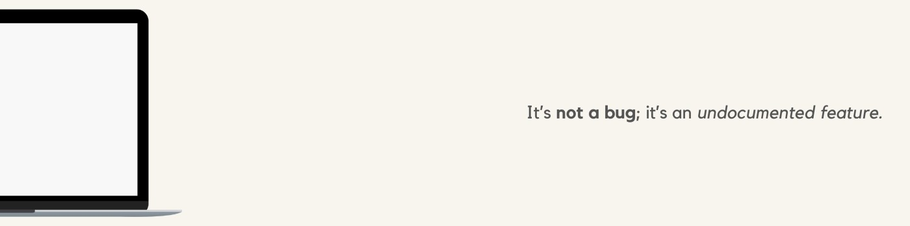

  

<h2 align="left">Hello World! I'm Shizain, a Computer Science major from India 👋</h2>

🚀 Currently building <b>CodeForge</b>, a full-stack competitive coding platform inspired by LeetCode & HackerRank. 
⚡ Exploring systems programming with Rust, wrote Hecto, a text CLI text editor, and a multithreaded HTTP web server from scratch. 
🌠Actively contributing to <b>open-source projects</b> like <a href="https://github.com/0xsambit/winix">Winix</a>. 
📠Pursuing B.Tech in Computer Science & Engineering at COER University, Roorkee (CGPA: 8.75). 
👨🏼‍💻 Leading the <b>Competitive Coding Club</b>, mentoring peers and organizing events. 
🧠Oh, and… I use <b>Arch Linux</b>, btw. 

<h2 align="left">💻 Tech Stack:</h2>

  
  
  
  
  
  
  
  
  
  
  
  
  
  
  
  
  
  
  
  
  
  
  

  

<picture align="center">
  <source media="(prefers-color-scheme: dark)" srcset="https://raw.githubusercontent.com/tobiasmeyhoefer/tobiasmeyhoefer/output/github-snake-dark.svg" />
  <source media="(prefers-color-scheme: light)" srcset="https://raw.githubusercontent.com/tobiasmeyhoefer/tobiasmeyhoefer/output/github-snake.svg" />
  
</picture>
